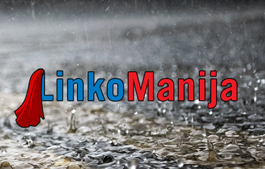
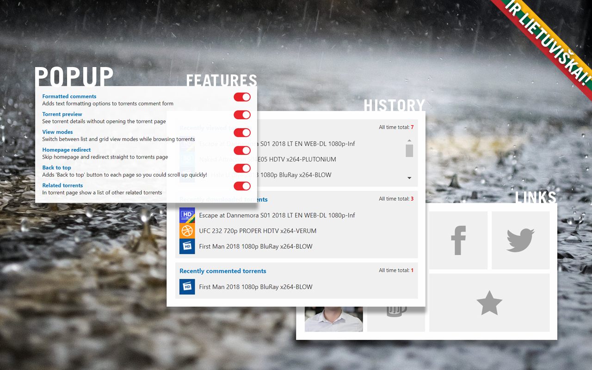
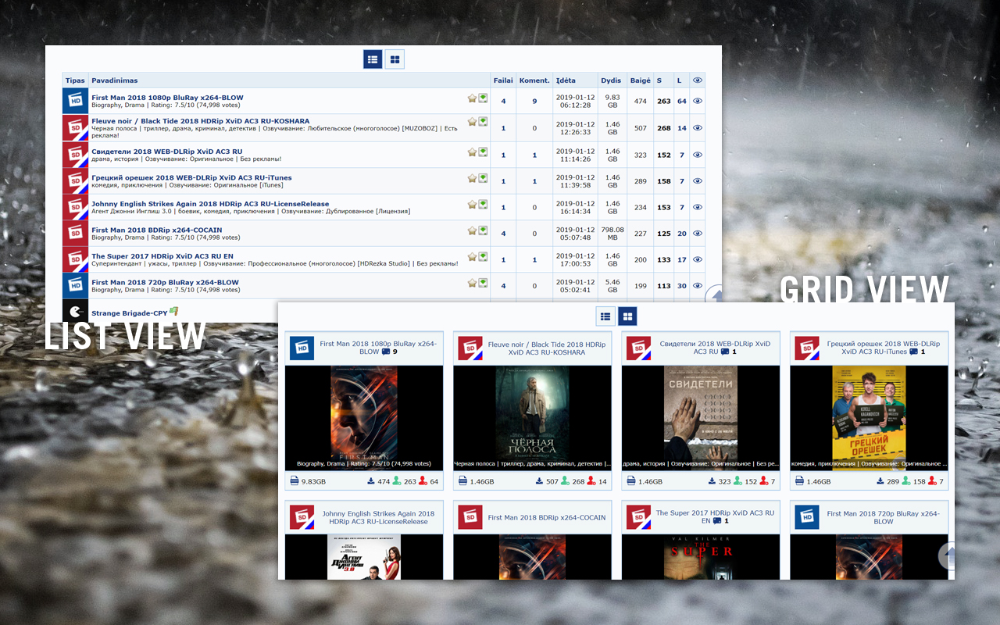
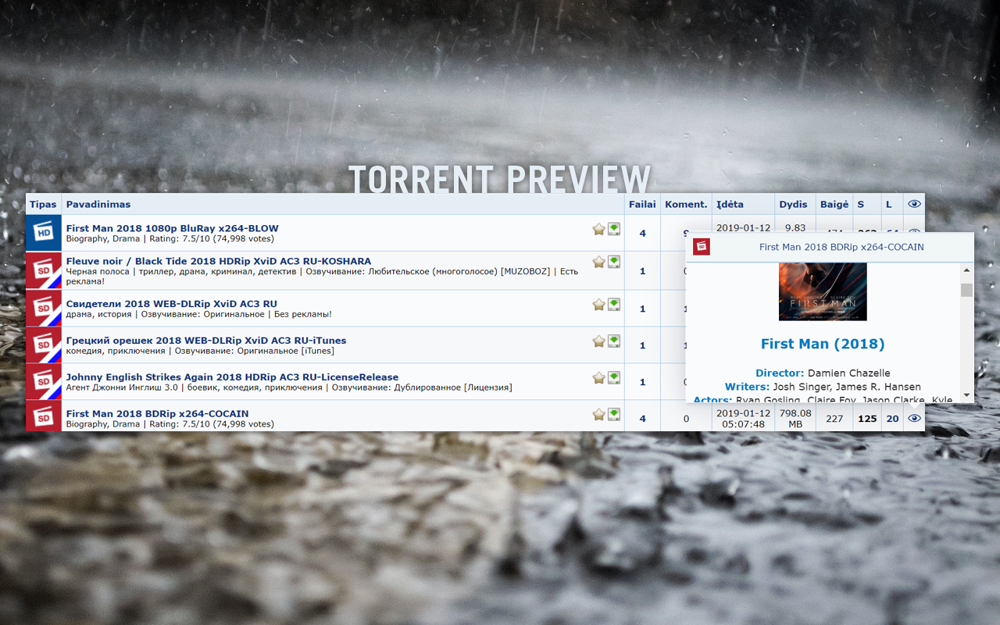
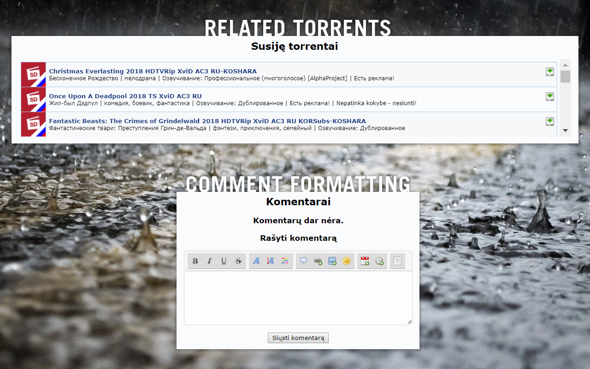

  

  
  
  
  
  

## Table of content
- [About](#about)
- [Features](#features)
- [Screenshots](#screenshots)
- [Installation](#installation)
- [Road map](#road-map)
- [Development](#development)
- [License](#license)

## About
Chrome extension with purpose to extend UX of oldest Lithuanian torrent web site http://www.linkomanija.net

## Features
1. Comment formatting
2. Torrent preview
3. Torrents view modes (list/grid)
4. Homepage redirect
5. Quick back to top
6. Related torrents

## Screenshots

## Installation
Currently you can only use this extension with Google Chrome web browser.
To install it please visit a Chrome web store page by clicking image below:

## Road map
* Port extension to browsers such as Firefox and Opera
* Add more features

## Development
Everyone is welcomed to contribute to the project or use the code for their own projects

To contribute you need to perform these steps:
1. Run `npm install` to install npm dependencies
2. Apply your changes and modifications
3. Run `npm run lint` to make sure code is well formatted
4. Run `npm run build` to compile the code and generate extension source folder
5. In your browser extensions window enable development mode and load MYGA extension from folder `extension` to test your changes

## License
The repository code is open-sourced software licensed under the [MIT license](https://github.com/SlimDogs/super-linkomanija/blob/master/LICENSE?raw=true).
