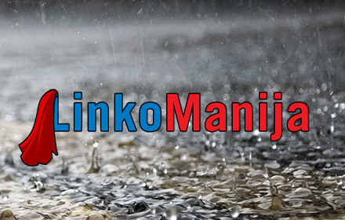
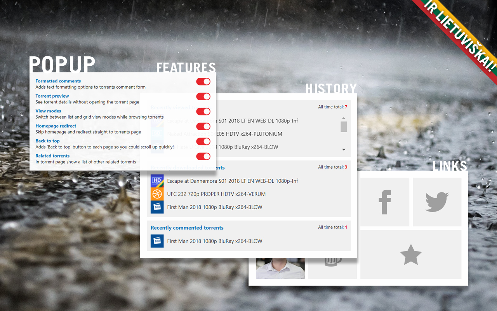
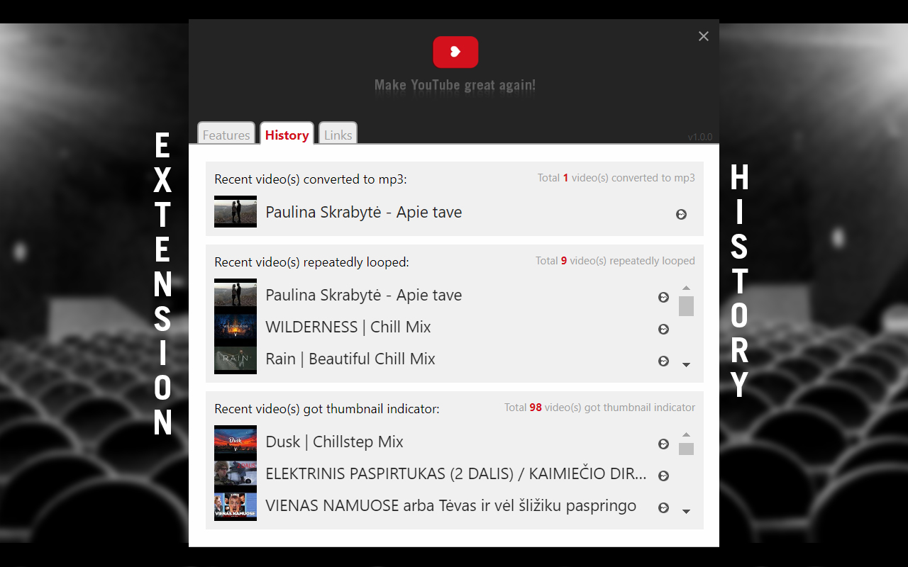
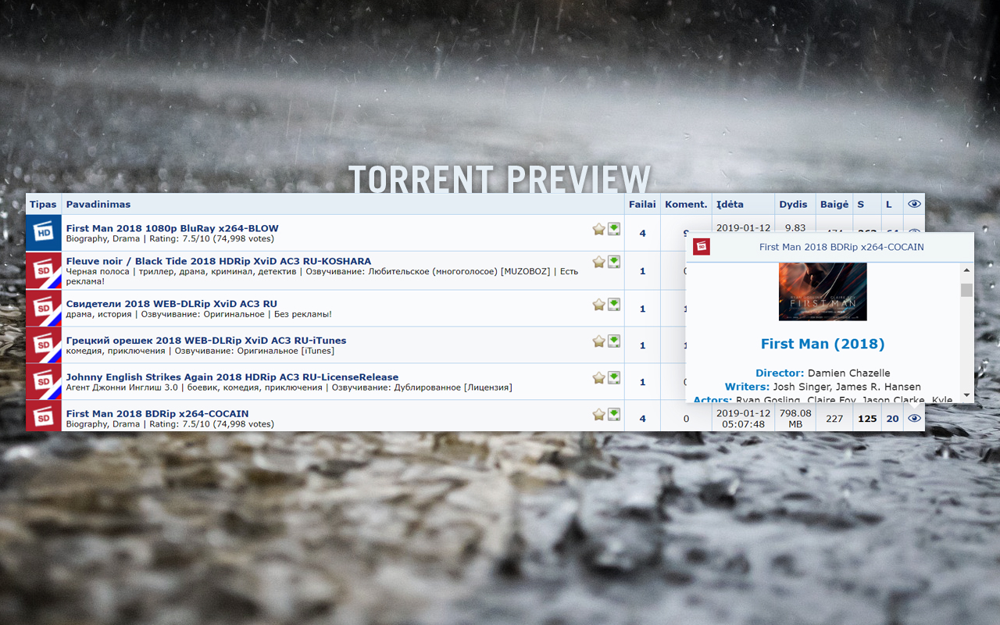
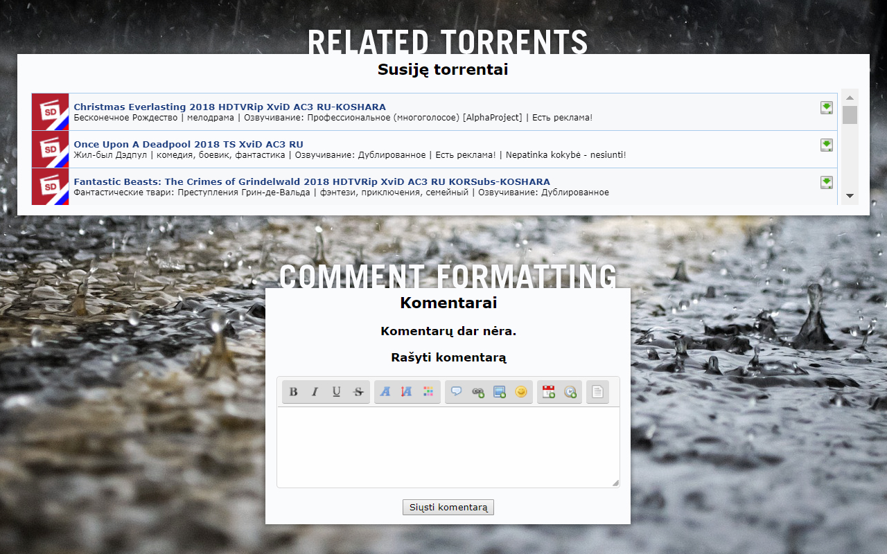

  

  
  
  
  

<strong><a href="https://tautvydasderzinskas.github.io/super-linkomanija/">Website</a></strong> · <a href="https://chromewebstore.google.com/detail/gmdhkalbljdblbogfladannflinppnji">Chrome Web Store</a> · <a href="https://microsoftedge.microsoft.com/addons/detail/dhmdmhhmpkhafcffhbihnpnfeknnnmlk">Edge Add-ons</a> · <a href="https://addons.mozilla.org/en-GB/firefox/addon/super-linkomanija/">Firefox Add-ons</a> · <a href="https://github.com/TautvydasDerzinskas/super-linkomanija/releases/latest">Latest release</a>

## About
Browser extension with purpose to extend UX of oldest Lithuanian torrent web site http://www.linkomanija.net

Features, screenshots and install instructions in English and Lithuanian are on the [website](https://tautvydasderzinskas.github.io/super-linkomanija/).

## Features
1. Comment formatting
2. Torrent preview
3. Torrents view modes (list/grid)
4. Homepage redirect
5. Quick back to top
6. Related torrents
7. Release tracker
8. Auto login

## Screenshots

## Installation
Chrome & Vivaldi users please click below:

Microsoft Edge users please click below:

Firefox users please head to link below:

## Contributing
Contributions are welcome, see [CONTRIBUTING.md](CONTRIBUTING.md) for development setup and guidelines.

## Support
If Super Linkomanija is useful to you, consider supporting its development:

- [GitHub Sponsors](https://github.com/sponsors/TautvydasDerzinskas)
- [Buy Me a Coffee](https://buymeacoffee.com/TautvydasDerzinskas)

## License
The repository code is open-sourced software licensed under the [MIT license](https://github.com/TautvydasDerzinskas/super-linkomanija/blob/main/LICENSE?raw=true).
